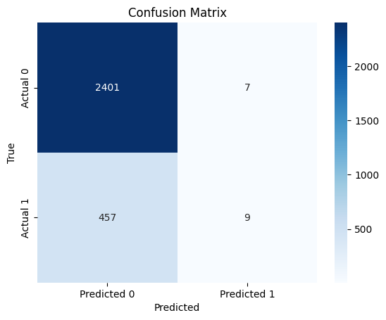
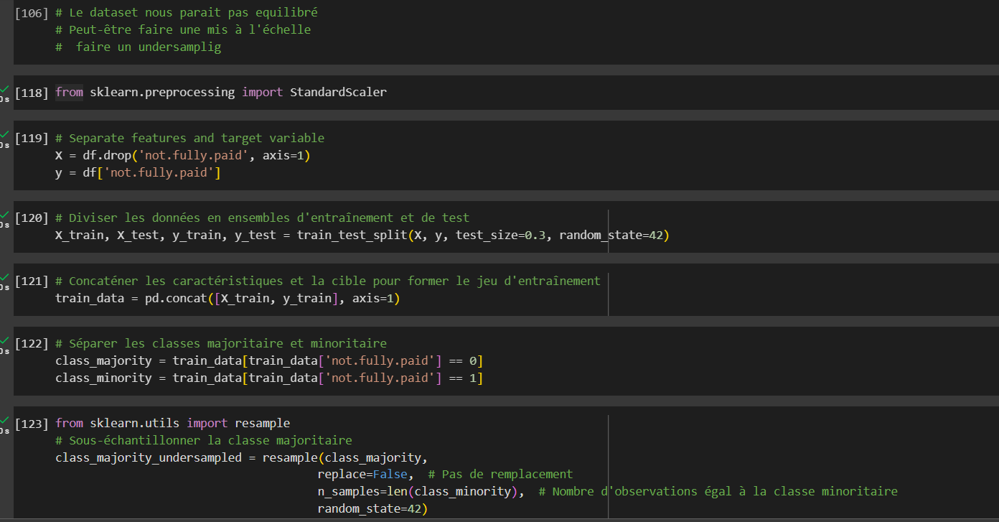
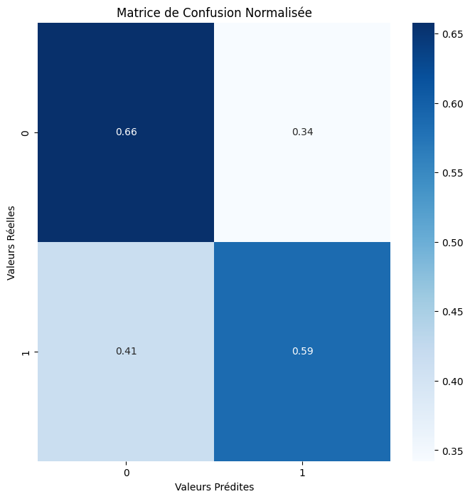

# reglog

# Rapport d'Analyse de Régression Logistique
## Introduction

Ce rapport présente une analyse détaillée des résultats obtenus à la suite de la mise en œuvre d'une régression logistique sur loan dataset. L'objectif principal de cette analyse était de prédire si un utilisateur allait rembourser son prêt ou pas

## Méthodologie

### Données

Les données utilisées pour cette analyse comprennent des colonnes categoriques et non categoriques. Un total de 9578 lignes et 14 colonnes. La target identifée est "not.fully.paid "
### Modèle

Nous avons appliqué un modèle de régression logistique pour modéliser la relation entre les variables indépendantes et la variable dépendante "not.fully.paid ".

## Résultats

### Accuracy (Exactitude) : 0.84
        L'accuracy représente la proportion totale de prédictions correctes par le modèle. Dans votre cas, le modèle a une accuracy de 0.84, ce qui signifie que 84% des prédictions sont correctes.

### Precision (Précision) : 0.56
        La précision mesure la proportion de vrais positifs parmi les exemples prédits comme positifs par le modèle. Dans votre cas, la précision est de 0.56, indiquant que 56% des exemples prédits comme positifs sont effectivement positifs.

### Recall (Rappel ou Sensibilité) : 0.02
        Le recall mesure la proportion de vrais positifs parmi tous les exemples réellement positifs. Dans votre cas, le recall est très faible, à 0.02, indiquant que le modèle a du mal à identifier correctement les exemples positifs.

### F1 Score : 0.04
        Le F1 Score est une métrique qui prend en compte à la fois la précision et le recall. Il est particulièrement utile lorsque les classes sont déséquilibrées. Dans votre cas, le F1 Score est de 0.04, ce qui suggère un compromis entre précision et recall.

### Negative Predictive Value (NPV) : 0.84
        Le NPV mesure la proportion de vrais négatifs parmi les exemples prédits comme négatifs par le modèle. Dans votre cas, le NPV est de 0.84, indiquant que 84% des exemples prédits comme négatifs sont effectivement négatifs.   

## Interprétation des Résultats

 L'accuracy est relativement élevée (84%), mais cela peut être trompeur en présence de classes déséquilibrées.
    La précision est relativement faible (56%), indiquant que le modèle a tendance à faire des faux positifs.
    Le recall est très bas (2%), ce qui signifie que le modèle a du mal à identifier les vrais positifs parmi tous les exemples réellement positifs.
    Le F1 Score reflète le compromis entre précision et recall, et il est également assez bas (4%).

Il semble y avoir un déséquilibre entre les classes, ce qui peut affecter l'interprétation des métriques. 

## Évaluation du Modèle
### Matrice de Confusion

La matrice de confusion montre les résultats de la comparaison entre les prédictions du modèle et les observations réelles. Elle est présentée ci-dessous :

array([[2408,    0],
       [ 465,    1]])

Par 2408 
    465
    0
    1

Alors ce que j'ai fais c'est passer par l'ACP, analyse par composante principale 

Puis, il fallait aussi faire une mise à l'échelle en plus d'équilibrer les données, comme le resultat le dit en haut, partie interpretations des resultats. 

Ci joint les resultat

    Précision (Precision) :
        Pour la classe 0, la précision est de 0.89. Cela signifie que parmi toutes les observations prédites comme classe 0, 89% sont réellement de la classe 0.
        Pour la classe 1, la précision est de 0.25. Cela signifie que parmi toutes les observations prédites comme classe 1, seulement 25% sont réellement de la classe 1.

    Rappel (Recall) :
        Pour la classe 0, le rappel est de 0.66. Cela signifie que le modèle a identifié correctement 66% de toutes les observations de la classe 0.
        Pour la classe 1, le rappel est de 0.59. Cela signifie que le modèle a identifié correctement 59% de toutes les observations de la classe 1.

    F1-Score :
        Le F1-score est une moyenne pondérée de la précision et du rappel. Pour la classe 0, le F1-score est de 0.76, et pour la classe 1, le F1-score est de 0.35.

    Support :
        Le support indique le nombre d'observations réelles dans chaque classe. Il y a 2408 observations de la classe 0 et 466 observations de la classe 1.

    Exactitude (Accuracy) :
        L'exactitude globale du modèle est de 0.65, ce qui signifie que le modèle a correctement classé 65% de toutes les observations.

    Macro AVG / Weighted AVG :
        La macro avg et la weighted avg fournissent des moyennes des métriques (précision, rappel, F1-score) pour toutes les classes. La weighted avg prend en compte le déséquilibre de classe.

# Conclusion

 Le modèle semble mieux performant pour la classe 0 en termes de précision, mais il a une performance relativement faible pour la classe 1.
    Le rappel pour la classe 0 est supérieur à celui de la classe 1, indiquant que le modèle identifie mieux les exemples de la classe 0.
    Le F1-score global est affecté par la classe minoritaire (classe 1), et son faible score suggère que le modèle a du mal à gérer cette classe.
    L'exactitude globale de 65% peut être influencée par le déséquilibre des classes, donc elle doit être interprétée avec prudence.
